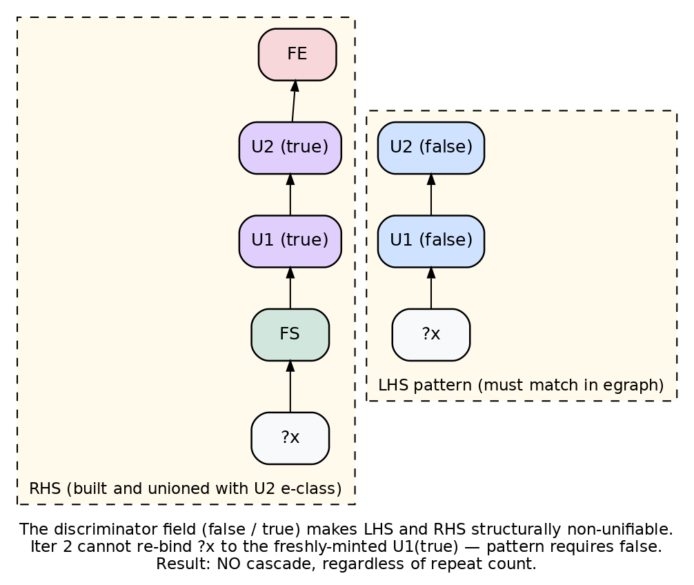
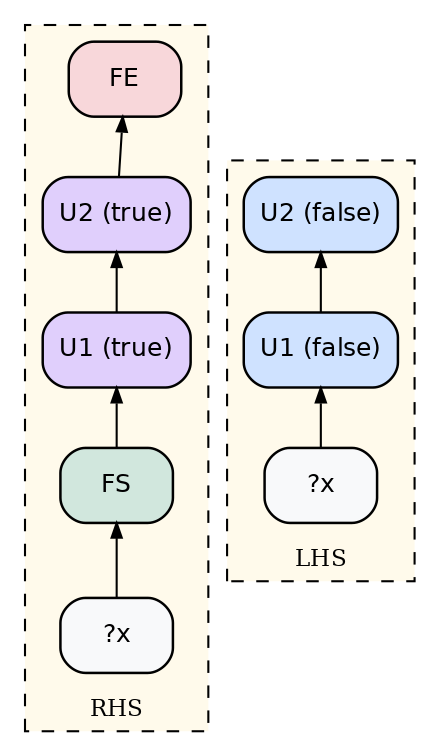
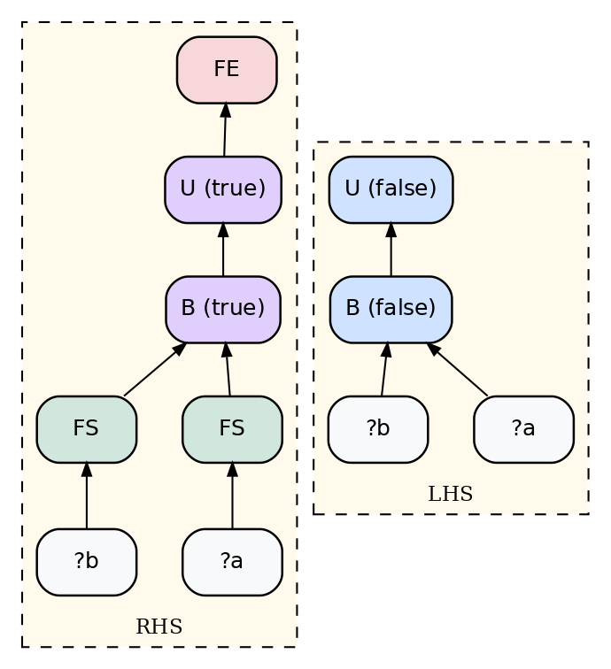
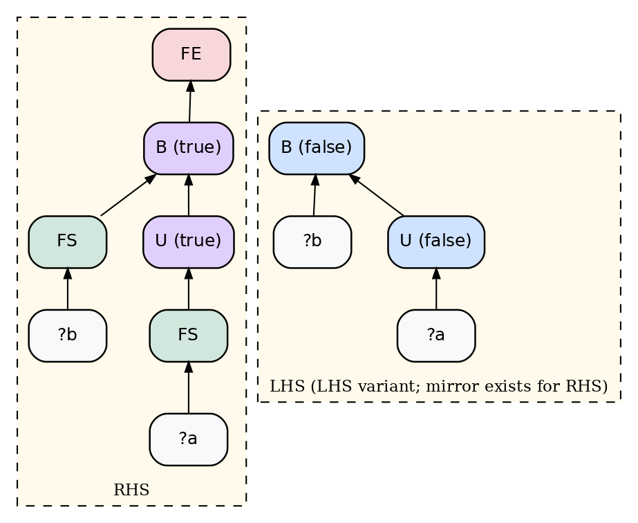
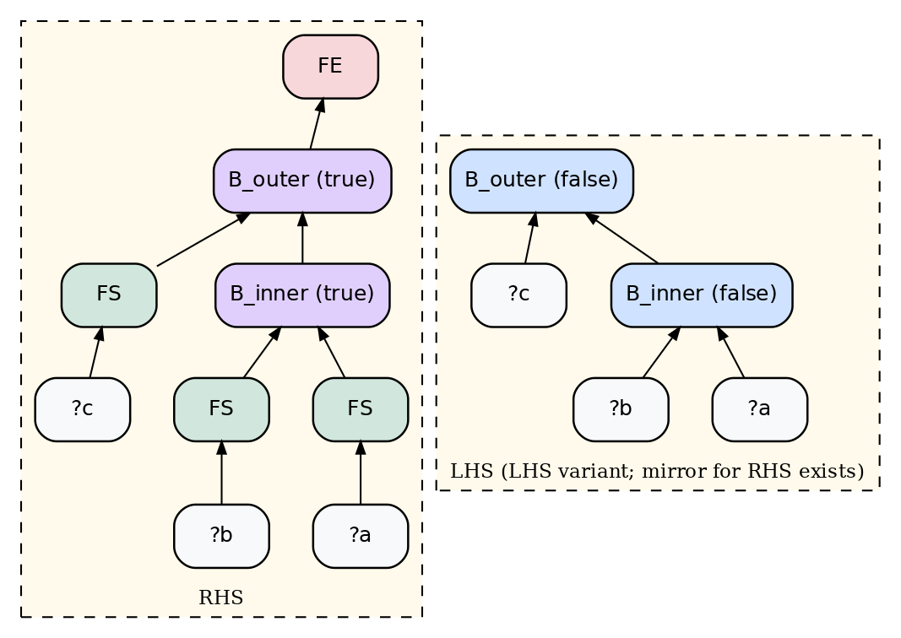
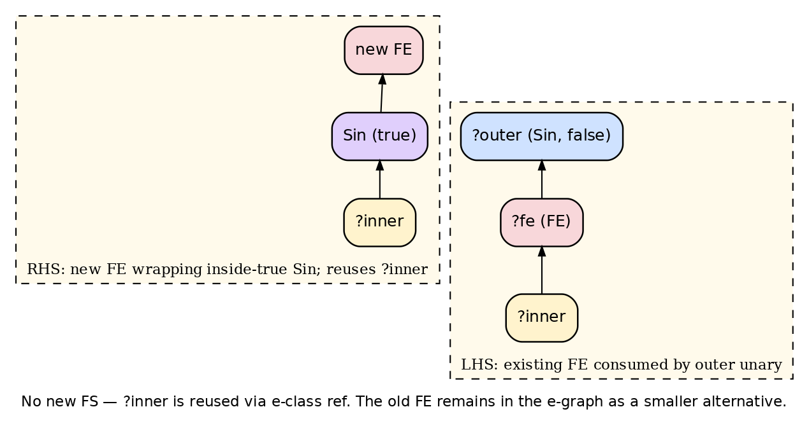
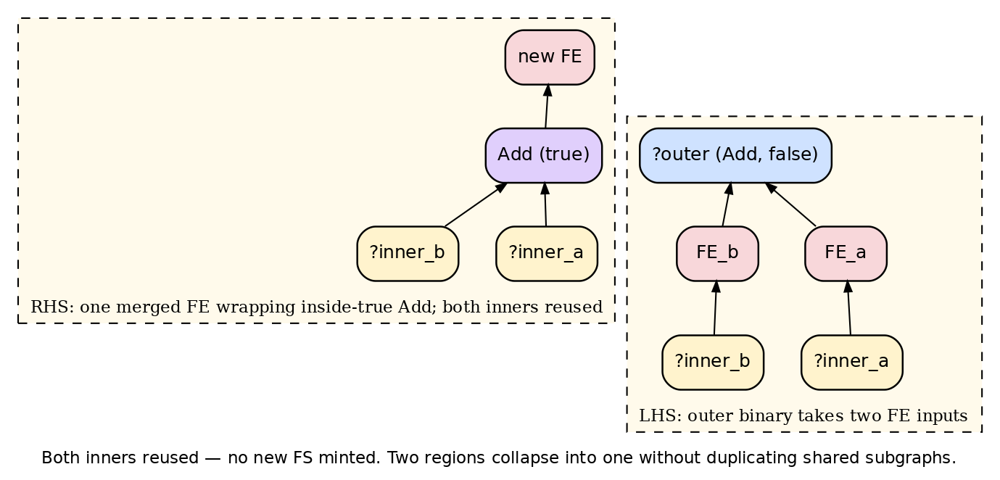
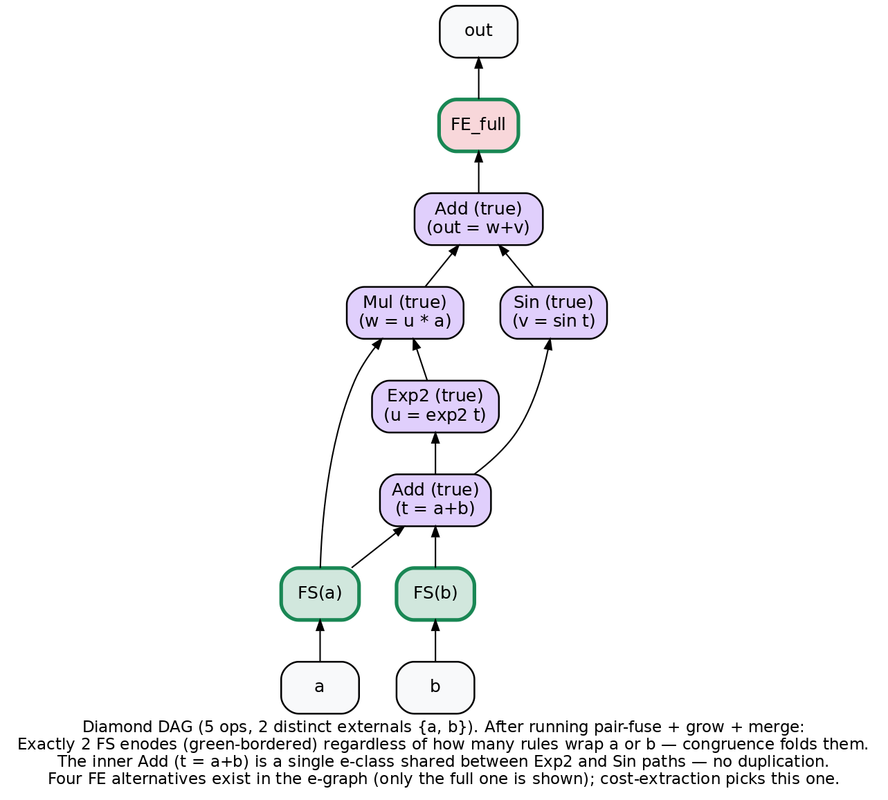

# Binary Elementwise Fusion — New Design (Discriminator-Based)

This document describes the design for binary-inclusive elementwise kernel fusion that replaces the seed/grow/merge rule set on `binary-fusion-fbody`. The design has been validated end-to-end against placeholder ops in `crates/luminal_cuda_lite/src/tests/discriminator_experiment.rs` (26 tests, all passing) before any changes to real kernel types.

## What broke in the old design

The old rule set seeded every elementwise op with a singleton fused form (`U(x)` ⇔ `FE(U(FS(x)))`). Each seed rule's LHS pattern matched its own RHS — `U(?x)` matches `U(FS(x))` with `?x = FS(x)` — so each `repeat` iteration mints another nested layer:

```
iter 1:  FE(Sin(FS(x)))
iter 2:  FE(Sin(FS(FS(x))))
iter 3:  FE(Sin(FS(FS(FS(x)))))
…
```

This is the cascade. Combined with separate FS enodes per rule firing, the diamond DAG ended up with `FS_a₁` and `FS_a₂` for the same external tensor `a`, breaking the `start_count == 2` invariant. Five FS enodes after `repeat 5`, linear growth in iteration count, e-graph explosion, and non-deterministic extraction.

## The new design in one sentence

Add a `Bool inside` discriminator field to every kernel op's egglog sort. Pair-fuse rules pin both the outer and inner ops to `inside = false`; their RHS produces fused-inside copies with `inside = true`. The structural mismatch makes the LHS pattern incapable of re-matching its own output, so cascade is provably impossible.



The diagram shows a unary-unary pair-fuse rule. The LHS pattern requires both `U1` and `U2` to carry `(false)`. The RHS builds an `FE(U2(true)(U1(true)(FS(?x))))` chain and unions it with the LHS root. On the next iteration, the pattern would need to bind to `U2(true)` or `U1(true)`, but the discriminator forbids that — same-bindings re-firing is hash-cons no-op, different-bindings re-firing is structurally blocked.

## Color legend

- **FE** (red) — `FusionEnd` marker, region output
- **FS** (green) — `FusionStart` marker, region external input
- **Op (false)** (blue) — original op outside any fused region
- **Op (true)** (purple) — fused-inside copy of an op
- **External input** (grey) — `?a`, `?b`, `?x` etc.
- **Inner ref** (yellow) — e-class reference to an upstream FE's body

## The four base cases (pair-fuse rules)

Every adjacent pair of compatible elementwise ops is one base case. There are four shapes depending on whether each side is a unary or binary.

### Base 1 — unary → unary (`U2(U1(?x))`)



Egglog rule:

```
(rule
  ((= ?u1 (U1 ?x false))
   (= ?u2 (U2 ?u1 false)))
  ((let ?fs       (FS ?x))
   (let ?u1_in    (U1 ?fs true))
   (let ?u2_in    (U2 ?u1_in true))
   (let ?fe       (FE ?u2_in))
   (union ?u2 ?fe))
  :name "pair-fuse-U1-U2")
```

Tested with `Sin(Sqrt(x))`. After `repeat 5`: 1 FS, 1 FE. Same input case `Sin(Sqrt(x))` collapses naturally because there's only one external tensor.

### Base 2 — binary → unary (`U(B(?a, ?b))`)



```
(rule
  ((= ?b (B ?a ?bb false))
   (= ?u (U ?b false)))
  ((let ?fs_a (FS ?a))
   (let ?fs_b (FS ?bb))
   (let ?b_in (B ?fs_a ?fs_b true))
   (let ?u_in (U ?b_in true))
   (let ?fe   (FE ?u_in))
   (union ?u ?fe))
  :name "pair-fuse-B-U")
```

Tested with `Exp(Add(a, b))`. After `repeat 10`: 2 FS, 1 FE. Shared input `Exp(Add(x, x))` collapses to 1 FS via congruence — both `FS(?a)` and `FS(?b)` enodes have the same child e-class, so hash-cons folds them.

### Base 3 — unary → binary (`B(U(?a), ?b)`)



```
(rule
  ((= ?u (U ?a false))
   (= ?b (B ?u ?bb false)))
  ((let ?fs_a (FS ?a))
   (let ?fs_b (FS ?bb))
   (let ?u_in (U ?fs_a true))
   (let ?b_in (B ?u_in ?fs_b true))
   (let ?fe   (FE ?b_in))
   (union ?b ?fe))
  :name "pair-fuse-U-B-LHS")
```

This case has a mirror because binary args are positional in egglog patterns: `B(?b, U(?a))` needs its own rule with the positions swapped. Tested with both directions plus a coexistence test (LHS+RHS rules in the same program produce 2 shared FSes via congruence and 2 distinct FEs).

The asymmetry: only the binary's external input gets an FS at the binary level. The unary's input has its own FS one level deeper. Total FS count is still 2 (one per distinct external tensor), determined by tensor count, not edge count.

### Base 4 — binary → binary (`B_outer(B_inner(?a, ?b), ?c)`)



```
(rule
  ((= ?bi (B_inner ?a ?b false))
   (= ?bo (B_outer ?bi ?c false)))
  ((let ?fs_a (FS ?a))
   (let ?fs_b (FS ?b))
   (let ?fs_c (FS ?c))
   (let ?bi_in (B_inner ?fs_a ?fs_b true))
   (let ?bo_in (B_outer ?bi_in ?fs_c true))
   (let ?fe    (FE ?bo_in))
   (union ?bo ?fe))
  :name "pair-fuse-B-B-LHS")
```

LHS + RHS mirror needed (same reason as base 3). Tested with `Mul(Add(a, b), c)` and `Mul(c, Add(a, b))`. After `repeat 10`: 3 FS, 1 FE. Shared-input case `Mul(Add(x, x), x)` collapses to 1 FS.

## The grow rule

Pair-fuse only handles 2-op fusions. To get a 3+ op region we need a rule that extends an existing region past one more compatible op.



```
(rule
  ((= ?fe (FE ?inner))
   (= ?outer (Sin ?fe false)))
  ((let ?inside  (Sin ?inner true))
   (let ?new_fe  (FE ?inside))
   (union ?outer ?new_fe))
  :name "grow-FE-Sin")
```

Key properties:

- `?inner` is reused via e-class ref — **no new FS is minted** when growing past a unary.
- The pattern requires `?outer` to have `inside = false`, so grow can't fire on already-inside copies. Discriminator-blocked from cascading exactly like pair-fuse.
- The old FE remains in the e-graph as a smaller fusion alternative. Cost-based extraction prefers the bigger FE.

A separate grow rule per outer op kind is needed (one per unary, two per binary for LHS/RHS). For binary grow, the new external input gets its own FS at the binary level — same idiom as the binary pair-fuse cases.

## The merge rule

When two FEs feed a binary on either side, both regions can be collapsed into one.



```
(rule
  ((= ?fe_a (FE ?inner_a))
   (= ?fe_b (FE ?inner_b))
   (= ?outer (Add ?fe_a ?fe_b false)))
  ((let ?inside (Add ?inner_a ?inner_b true))
   (let ?new_fe (FE ?inside))
   (union ?outer ?new_fe))
  :name "merge-FEs-Add")
```

Both inners are reused — no new FS minted. This is the rule that makes the diamond DAG fuse into one region: the outer Add of `out = w + v` consumes `w`'s FE (from the Mul branch, after pair-fuse + grow) and `v`'s FE (from the Sin branch, after pair-fuse), and merge collapses them.

## Putting it all together — the diamond DAG

The diamond was the test case the old design failed on:

```
t = a + b
u = exp2(t)
v = sin(t)
w = u * a       ← reuses external a
out = w + v
```

Five ops, two distinct external tensors `{a, b}`. The reuse of `a` was the source of the `FS_a₁` / `FS_a₂` spurious-duplicate problem: each rule firing minted its own FS for `a` and they never unified.

With the new design, after running pair-fuse + grow + merge to fixpoint:



| Quantity | Value | Why |
|---|---|---|
| Distinct FS enodes | **2** (FS(a), FS(b)) | Congruence/hash-cons folds every wrap of the same external tensor regardless of which rule produced it |
| Distinct FE enodes | 4 | Four alternatives: `{Add,Exp2}`, `{Add,Sin}`, `{Add,Exp2,Mul}`, full diamond. Cost-extraction picks the full one. |
| Shared inner Add | 1 e-class | The inner `t = a+b` is a single e-class shared between the Exp2 and Sin paths — no duplication |
| Stability under `repeat 20` | identical to `repeat 5` | Discriminator blocks all cascade paths |

The egglog `(check ...)` proves the full 5-op fused term is in `out`'s e-class — `(FS a)` appears 3 times in the term but resolves to one enode in the e-graph.

## Tradeoff: alternative-FE accumulation

There's one cost the design pays: for an N-op chain, pair-fuse fires on every adjacent pair *and* grow extends each pair forward, producing one FE per contiguous subchain of length ≥ 2. That's `N(N−1)/2` FE enodes — quadratic in chain length.

| Chain length N | FE alternatives | Realistic? |
|---|---|---|
| 5 | 10 | yes (typical LLM elementwise chain) |
| 10 | 45 | yes |
| 20 | 190 | borderline |
| 100 | 4950 | unlikely in practice |

These are **not** cascade duplicates. Each represents a distinct fusion choice with a distinct output value (`FE_{Add,Exp2}` produces `exp2(a+b)`, `FE_{Add,Exp2,Mul}` produces `exp2(a+b)*a` — different runtime values, different e-classes). Cost-based extraction ranks them and picks the biggest.

For practical model code (chains of ~5-10 ops, DAG widths of similar order) this is well within egglog's capacity. If we ever need to tighten further, two options:

1. **Egglog `(subsume ...)`** in the grow rule's RHS to mark the old FE as not-for-extraction once it's been grown past.
2. **Materialized "is-root" relation** to gate pair-fuse on outer ops that are not yet inside any region — encodes negation by reflection on the e-graph.

Both add machinery. Recommend deferring until measured.

## What changes in the real `KernelFoo` types

The discriminator is the only structural change. For each kernel op (every existing `KernelSin`, `KernelAdd`, etc.) in `crates/luminal_cuda_lite/src/kernel/other_ops.rs`:

1. Add a `bool` field to the egglog sort signature. Concretely, `sort()` would append `("inside", BOOL)` to the field list.
2. Add a corresponding Rust field (defaults to `false` for ops created by the frontend; `true` for fused-inside copies emitted by rules).
3. Update existing rules that pattern-match the kernel op to either pin the new field to `false` or take it as a don't-care `?inside_dontcare` variable.
4. Codegen ignores the field for emission — an inside Sin compiles to the same CUDA as an outside Sin. The field only matters during egglog rule firing.

Replace the current `FusionEnd::rewrites()` with the seven rule families described above:

- 4 pair-fuse families (one per base case shape) × 2 directions for binary ops where applicable
- 1 grow-unary family (one rule per unary op kind)
- 2 grow-binary families (LHS and RHS variants)
- 1 merge family (one rule per binary op kind)

Then un-ignore `test_fused_region_starts_match_distinct_external_tensors` and update `test_diamond_dag_fuses` to expect `start_count == 2` (the design invariant the old rule set couldn't deliver).

## Validation summary

Test harness: `crates/luminal_cuda_lite/src/tests/discriminator_experiment.rs`

26 tests, all passing, covering:

| Group | Tests | Headline result |
|---|---|---|
| Baseline (no discriminator) | 1 | FS=5 after `repeat 5` (cascade confirmed) |
| Base case 1 (U→U) | 4 | FS=1, FE=1 stable; 3-op chain stable; check passes |
| Base case 2 (B→U) | 3 | FS=2, FE=1; same-input → FS=1 |
| Base case 3 (U→B, LHS+RHS+coexist) | 6 | FS=2, FE=1 each; coexist → 2 shared FS, 2 FE |
| Base case 4 (B→B, LHS+RHS+coexist) | 6 | FS=3, FE=1 each; all-shared → FS=1 |
| Forward grow rules (3-op + 4-op chain + binary grow) | 3 | FS minimal, FE quadratic; full fusion reachable |
| Merge at binary | 1 | Two branch FEs collapse to one |
| Diamond DAG | 2 | **FS=2, FE=4, stable across `repeat 5`/`repeat 20`** |

The diamond DAG result is the design's primary proof point: it reproduces the topology that broke the old rule set and shows the new design satisfies the `start_count == 2` invariant without any manual canonicalization.
