# Binary Elementwise Fusion — Rule-by-Rule Review

Source: `crates/luminal_cuda_lite/src/kernel/other_ops.rs`, `FusionEnd::rewrites()` (lines ~2265–2475).

## Notation

- **FE** = `FusionEnd` marker op (single input). Drawn red.
- **FS** = `FusionStart` marker op (single input). Drawn green.
- **U** = any unary in {Sin, Sqrt, Exp, Exp2, Log2, Recip}. Drawn blue.
- **B** = any binary in {Add, Mul}. Drawn purple.
- **External inputs** (`a`, `b`, `x`) drawn grey.
- **Inner refs** (`inner`, `inner_a`, `inner_b`) drawn yellow — these are e-class references to the body of an upstream FE, reused without re-wrapping.

The rules use `(union ?lhs ?rhs)`, so both forms end up in the same e-class. They are equivalent, not directional rewrites. Variables prefixed `?` are e-class references in egglog; reusing the same `?x` means the same e-class, not a duplicated subtree.

## Rule families and counts (22 rules total)

| # | Family | Count | Pattern shape |
|---|---|---|---|
| 1 | Seed Unary | 6 | `U(x)` ⇒ `FE(U(FS(x)))` |
| 2 | Seed Binary | 2 | `B(a, b)` ⇒ `FE(B(FS(a), FS(b)))` |
| 3 | Grow FE→Unary | 6 | `U(FE(inner))` ⇒ `FE(U(inner))` |
| 4 | Grow FE→Binary, FE on LHS | 2 | `B(FE(inner_a), b)` ⇒ `FE(B(inner_a, FS(b)))` |
| 5 | Grow FE→Binary, FE on RHS | 2 | `B(a, FE(inner_b))` ⇒ `FE(B(FS(a), inner_b))` |
| 6 | Merge | 2 | `B(FE(inner_a), FE(inner_b))` ⇒ `FE(B(inner_a, inner_b))` |

---

## Rule 1 — Seed Unary

For each unary `U`:

**LHS (matched pattern):**

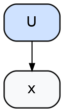

**RHS (created and unioned with LHS root):**

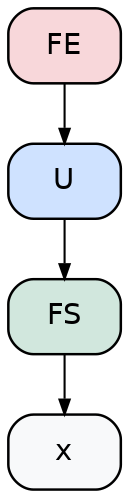

**What it does.** Inserts a singleton "fused" form for every unary occurrence in the graph.

**Issue (cascade / self-rematching).** The pattern `U(?x)` is structural — it matches ANY `U(?something)`. After this rule fires, the e-class of `U(x)` contains `FE(U(FS(x)))`. Inside that new term, the inner `U(FS(x))` is still a `U(?something)`, so the pattern re-matches with `?x = FS(x)`:

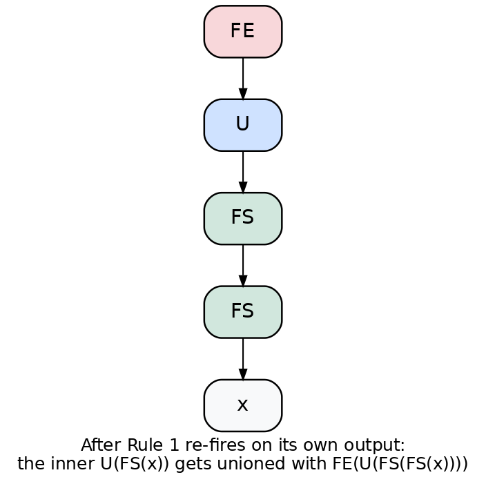

…and unions the new form with the **inner** `U(FS(x))`. That contaminates the inner e-class with FE-rooted forms, so when downstream rules look at the inner of any FE, they may pick one of these nested forms. Each `repeat 10` iteration in the schedule adds another nesting layer. This is the documented "cascade wart."

---

## Rule 2 — Seed Binary

For each binary `B`:

**LHS:**

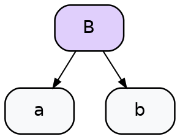

**RHS:**

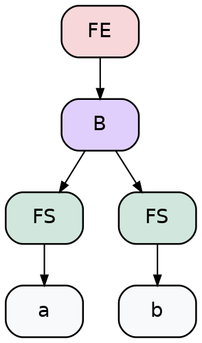

**Issue.** Same self-rematching as Rule 1. The pattern `B(?a, ?b)` re-matches the inner `B(FS(a), FS(b))` of its own output, with `?a = FS(a)`, `?b = FS(b)`. Each re-firing wraps an additional FS layer.

---

## Rule 3 — Grow FE → Unary

For each unary `U`:

**LHS:**

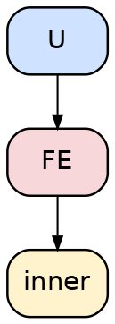

**RHS:**

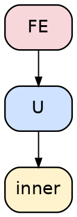

**What it does.** Relocates the FE past a unary, absorbing the unary into the region. Does **not** mint a new FS — `inner` is reused directly.

**Issue (fan-out duplication).** When the *same* `FE_t` is consumed by two different unaries (e.g., the diamond's `t` feeding both `Exp2` and `Sin`), this rule fires independently for each consumer. We end up with two FE-rooted e-classes (`FE(Exp2(t_inner))` and `FE(Sin(t_inner))`) that share the same `t_inner` e-class. Combined with Rule 6 below, that gives the merge step multiple structurally-distinct ways to extract the unified form — which is the source of the diamond non-determinism.

---

## Rule 4 — Grow FE → Binary, FE on LHS

For each binary `B`:

**LHS:**

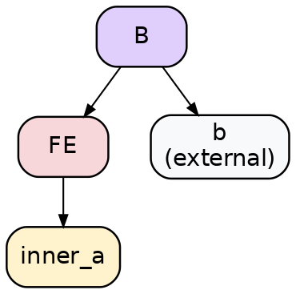

**RHS:**

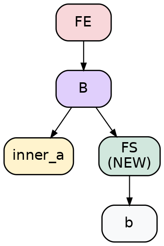

**Issue (FS multiplication).** This mints a **brand-new FS node** every time it fires (highlighted in the RHS as `FS (NEW)`). There is no canonicalization rule unifying two FS nodes that wrap the same source tensor. If `b`'s e-class is the same external tensor that an earlier rule already wrapped in `FS_b1`, this firing produces `FS_b2` — a distinct e-node — and both stick around.

In the diamond: the outer `Add(a, b)` is wrapped by Seed Binary creating `FS_a1, FS_b1`. Later, `Mul(u, a)` triggers this rule (LHS variant) and creates `FS_a2` for the *same* `a`. The fused region's extracted tree shows 3 FS nodes for `{a, b}` when the design says 2.

---

## Rule 5 — Grow FE → Binary, FE on RHS

Mirror of Rule 4:

**LHS:**

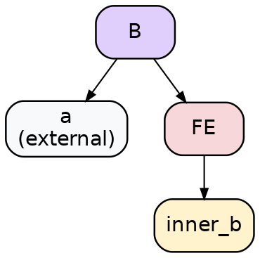

**RHS:**

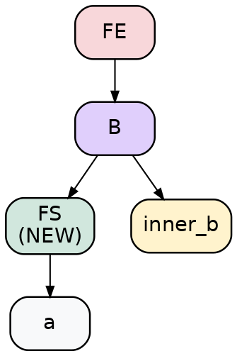

Same issue as Rule 4.

---

## Rule 6 — Merge

For each binary `B`:

**LHS:**

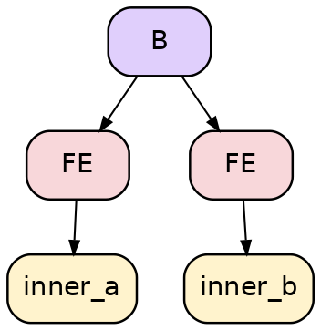

**RHS:**

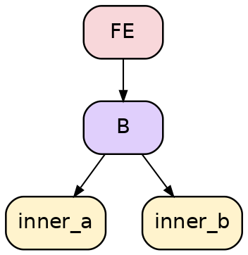

**What it does.** When two regions meet at a binary (both inputs are FEs), this collapses them into one region — no new FS minted, the binary just feeds from each region's inner directly.

**Issue (extraction non-determinism).** `inner_a` and `inner_b` are e-class references. If they happen to share an underlying e-class (the diamond case: `inner_a` and `inner_b` both transitively reference `t`'s e-class), the extractor — which picks one e-node per e-class per call — can produce different surface forms across runs. Each form is correct, but they look different, hence the random extractor needs ~200 samples to reliably surface the canonical one.

---

## Worked example: the diamond DAG

Source program:

```
Inputs: a, b
t   = a + b
u   = exp2(t)
v   = sin(t)
w   = u * a       ← reuses external a
out = w + v
```

Sequence of rule firings (one valid order):

1. **Rule 2** fires on `t = Add(a, b)`. Creates `FS_a1`, `FS_b1`, and `FE(Add(FS_a1, FS_b1))`. `t`'s e-class now contains both forms.
2. **Rule 3** fires on `Exp2(FE_t)` — relocates the FE past Exp2.
3. **Rule 3** fires INDEPENDENTLY on `Sin(FE_t)` — relocates a separate FE past Sin. Both share `t`'s inner e-class.
4. **Rule 4** fires on `Mul(FE_u, a)` — mints a fresh **`FS_a2`** wrapping `a`, distinct from `FS_a1`.
5. **Rule 6** (Merge) fires on `out = Add(w, v)` — both `w` and `v` are FE e-classes, so they collapse into one outer FE.

**Final fused form:**

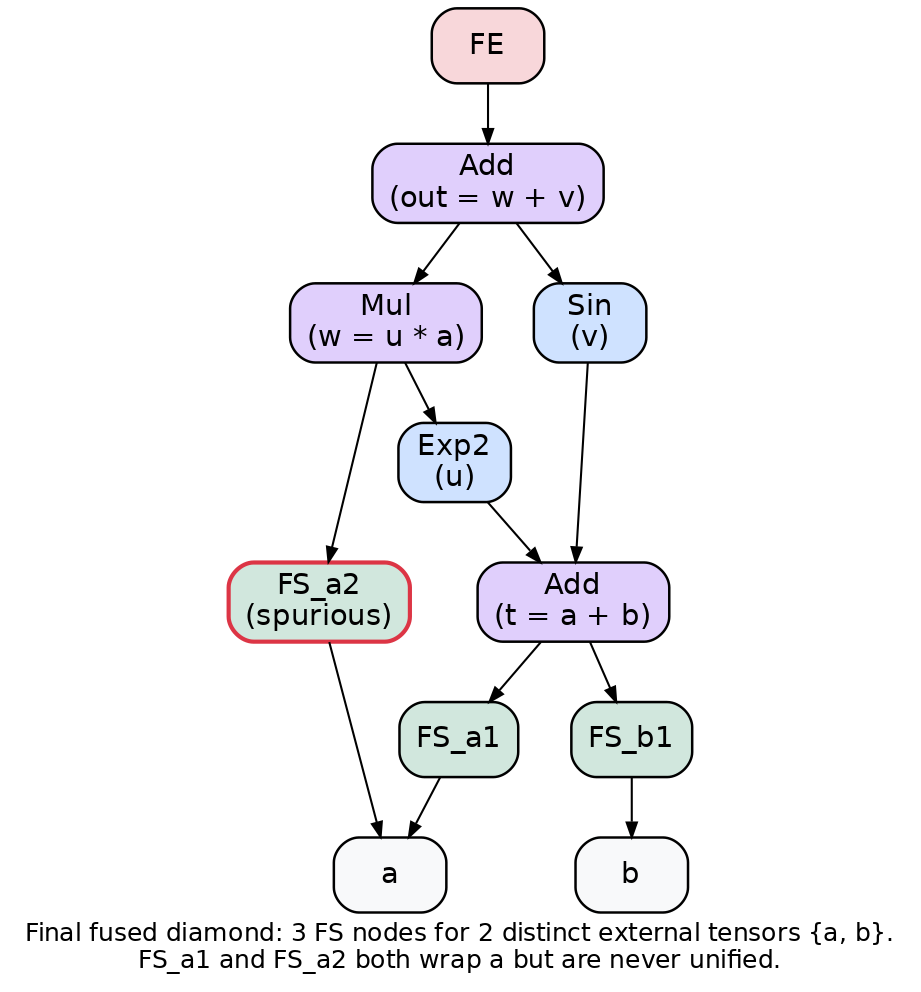

**Observations:**

- 3 distinct FS nodes (`FS_a1`, `FS_a2`, `FS_b1`) for 2 distinct external tensors `{a, b}`. `FS_a2` (highlighted with red border) is the spurious duplicate. This is what makes `test_fused_region_starts_match_distinct_external_tensors` need `#[ignore]` and the `resolve_source` workaround in the test harness.
- The inner `Add` e-class is shared between `Exp2` and `Sin` paths in the egraph. But during extraction, each parent context picks an e-node independently, so the surface tree may show two structurally-different encodings of the same e-class. Combined with the cascade nesting, this gives many equivalent extracted forms — driving non-determinism.

---

## Summary of issues, ranked

1. **Self-rematching in Seed rules (1, 2).** The patterns `U(?x)` and `B(?a, ?b)` match their own outputs, producing nested-FS cascades. Bounded only by `repeat 10`. Drives the "explosion" in egraph size.

2. **No FS canonicalization.** Each invocation of Grow-FE→Binary (Rules 4, 5) mints a fresh FS. Different rule firings that wrap the same source tensor produce distinct FS e-nodes that never get unified. Drives the FS-count-too-high problem on reused inputs.

3. **Fan-out + Merge ⇒ extraction non-determinism (Rules 3, 6).** When a shared term feeds multiple consumers and a merge later joins those branches, extraction of the unified form has many structurally-distinct equivalent encodings. The random extractor samples among them, so test results vary across runs.

4. **No "already inside a region" guard.** None of the rules check whether their input is already part of a fused region. Every elementwise op gets touched by Seed; every adjacency gets re-touched by Grow even after it's been absorbed.

## Possible directions to consider

- **Drop Seed rules.** Singletons aren't worth fusing. If we only fire pair-fuse rules (binary↔unary, binary↔binary, etc.), the cascade goes away because the pattern requires a specific neighbor topology that the rule's own output doesn't satisfy.
- **FS canonicalization rule.** `FS(?x) ≡ FS(?x)` for distinct FS e-nodes whose child e-class matches. Egglog should fold these via congruence as long as they have identical fields (shape, strides, dtype, child e-class). Worth verifying this isn't already happening and being defeated by a field mismatch.
- **Replace markers with a single multi-input op** (generalized `KernelFusedElementwise`). Trades elegance for representational sharing — the body becomes one structured field, no DAG-via-tree-rewriting issues.
